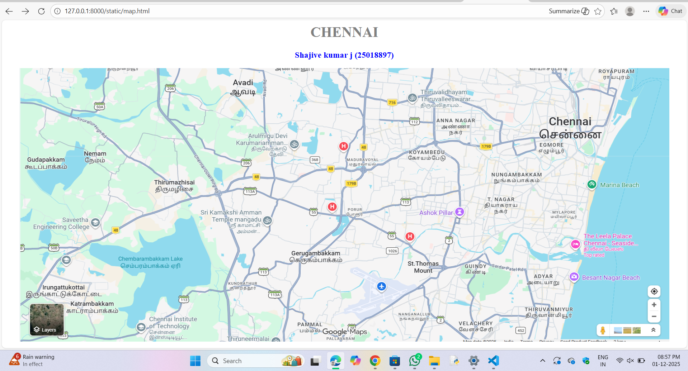
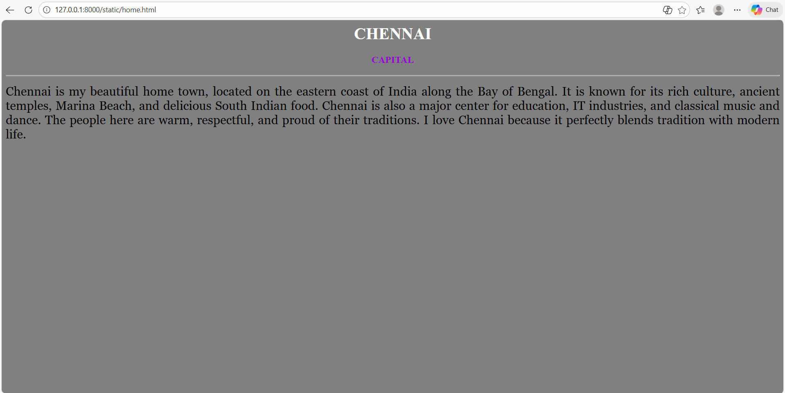
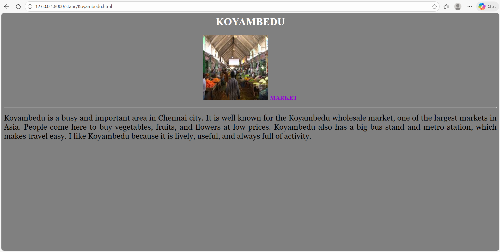
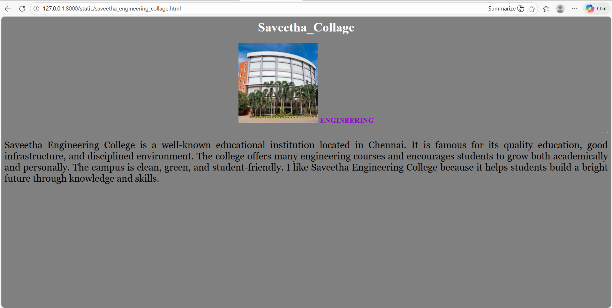
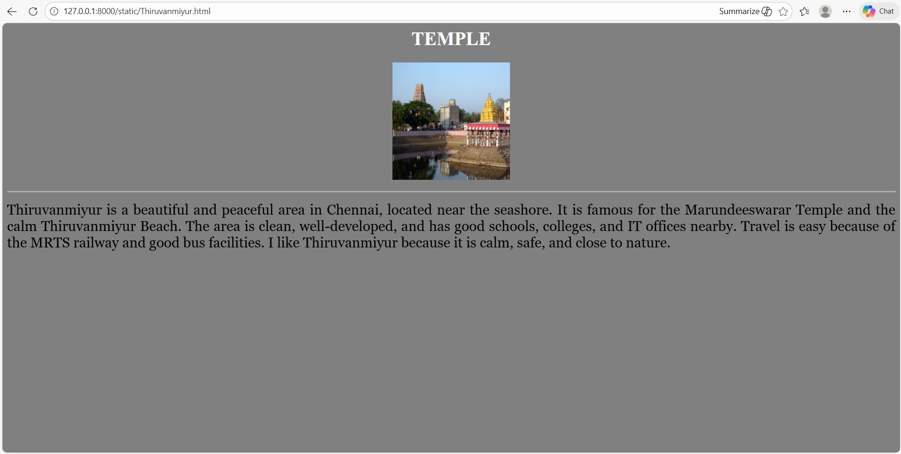

# Ex04 Places Around Me
## Date: 01-12-2025
## Ref No: 25018897

## AIM
To develop a website to display details about the places around my house.

## DESIGN STEPS

### STEP 1
Create a Django admin interface.

### STEP 2
Download your city map from Google.

### STEP 3
Using ```<map>``` tag name the map.

### STEP 4
Create clickable regions in the image using ```<area>``` tag.

### STEP 5
Write HTML programs for all the regions identified.

### STEP 6
Execute the programs and publish them.

## CODE 
~~~
map.html
       <html>
    <head>
        <title>My City</title>
    </head>
    <body>
        <h1 align="center">
        <font color="GRAY"><b>CHENNAI</b></font>
    </h1>
    <h3 align="center">
        <font color="blue"><b>Shajive kumar j  (25018897)</b></font>
    </h3>
    <center>
        
        <map name="#MyCity">
        <area shape="rect" coords="1000,100,1200,300" href="home.html" title="My Home Town">
        <area shape="rect" coords="10,300,200,560" href="saveetha_engineering_collage.html" title="Saveetha_Collage">
        <area shape="rect" coords="1000,172,700,300" href="Koyambedu.html" title="koyambedu">
        <area shape="rect" coords="1186,500,1100,600" href="Thiruvanmiyur.html" title="Thiruvanmiyur">
    </map>
    </center>
        </body>
    </body>
</html>
~~

~~
home.html
        <html>
    <head>
        <title>My Home Town</title>
    </head>
    <body bgcolor="gray">
        <h1 align="center">
            <font color="white"><b>CHENNAI</b></font>
        </h1>
        <h3 align="center">
            <font color="DarkViolet"><b>CAPITAL</b></font>
        </h3>
        <hr size="3" colour="red">
        <p align="justify">
        <font face="Georgia" size="5">
            Chennai is my beautiful home town, located on the eastern coast of India along the Bay of Bengal. It is known for its rich culture, ancient temples, Marina Beach, and delicious South Indian food. Chennai is also a major center for education, IT industries, and classical music and dance. The people here are warm, respectful, and proud of their traditions. I love Chennai because it perfectly blends tradition with modern life.
        </font>    
        </p>
    </body>
</html>     
        
~~
~~
saveetha_engineering_collage.html
                              <html>
    <head>
        <title>Saveetha_Engineering_Collage</title>
    </head>
    <body bgcolor="gray">
        <h1 align="center">
            <font color="white"><b>Saveetha_Collage</b></font>
        </h1>
        <h3 align="center">
            
            <font color="DarkViolet"><b>ENGINEERING</b></font>
        </h3>
        <hr size="3" colour="red">
        <p align="justify">
        <font face="Georgia" size="5">
            Saveetha Engineering College is a well-known educational institution located in Chennai. It is famous for its quality education, good infrastructure, and disciplined environment. The college offers many engineering courses and encourages students to grow both academically and personally. The campus is clean, green, and student-friendly. I like Saveetha Engineering College because it helps students build a bright future through knowledge and skills.
            
        </font>    
        </p>
    </body>
</html>
~~
~~
koyambedu.html
             <html>
    <head>
        <title>Koyambedu</title>
    </head>
    <body bgcolor="gray">
        <h1 align="center">
            <font color="white"><b>KOYAMBEDU</b></font>
        </h1>
        <h3 align="center">
            
            <font color="DarkViolet"><b>MARKET</b></font>
        </h3>
        <hr size="3" colour="red">
        <p align="justify">
        <font face="Georgia" size="5">
            Koyambedu is a busy and important area in Chennai city. It is well known for the Koyambedu wholesale market, one of the largest markets in Asia. People come here to buy vegetables, fruits, and flowers at low prices. Koyambedu also has a big bus stand and metro station, which makes travel easy. I like Koyambedu because it is lively, useful, and always full of activity.
           
        </font>    
        </p>
    </body>
</html>
~~
~~
thiruvanmiyur.html
                  <html>
    <head>
        <title>Thiruvanmiyur</title>
    </head>
    <body bgcolor="gray">
        <h1 align="center">
            <font color="white"><b>TEMPLE</b></font>
        </h1>
        <h3 align="center">
            
            <font color="DarkViolet"><b></b></font>
        </h3>
        <hr size="3" colour="red">
        <p align="justify">
        <font face="Georgia" size="5">
            Thiruvanmiyur is a beautiful and peaceful area in Chennai, located near the seashore. It is famous for the Marundeeswarar Temple and the calm Thiruvanmiyur Beach. The area is clean, well-developed, and has good schools, colleges, and IT offices nearby. Travel is easy because of the MRTS railway and good bus facilities. I like Thiruvanmiyur because it is calm, safe, and close to nature.
            
        </font>    
        </p>
    </body>
</html>
~~~


## OUTPUT







## RESULT
The program for implementing image maps using HTML is executed successfully.
